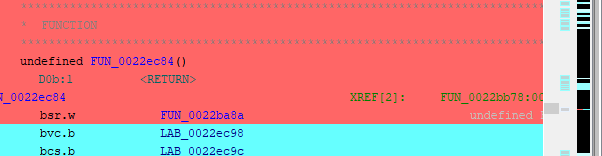

# GhidraColorbarPlugin

This is an extension for Ghidra that adds a new type of vertical overview strip at the right border
(next to the scrollbar) of the listing window. The overview shows the locations of the
colored lines in the currently loaded program. You can activate the overview by clicking on the
icon in the toolbar of the listing view:

Ghidra already comes with several types of overview bars, that is, the AddressType overview,
the Entropy overview, and the Marker overview. The latter does, among other things, also show the
location of colored lines. The main differences between the existing Marker overview and this
extension are:
- This extension uses fine lines of 1px thick instead of rectangles to indicate the locations of colored lines. That makes it easier to identify lines close to each other.
- The color indicators in the overview are identical to the colors of the lines. The existing Marker overview always uses the same color, independently of the color of the line.
- Lines with different colors that are close to each other are shown as "half-filled" lines in the overview (this is only works for two colors). See the picture below.

As usual, this software comes without any warranty or guarantees. Use it at your own risk.

# Technical notes

This extension has been derived from the OverviewColorPlugin shipped with Ghidra. It would have
been much more elegant to implement this plugin as an OverviewColorService because it would then
nicely integrate into the list of existing overview color services (that is, AddressType and EntropyOverview).
Unfortunately, the OverviewColorComponent does not publish all the methods and fields that are needed by
this plugin.
